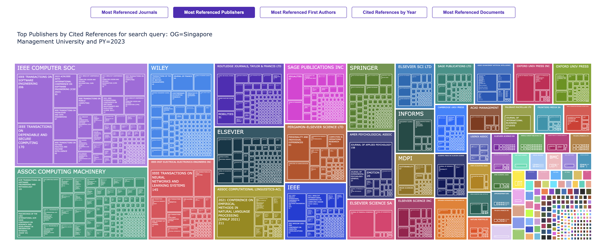
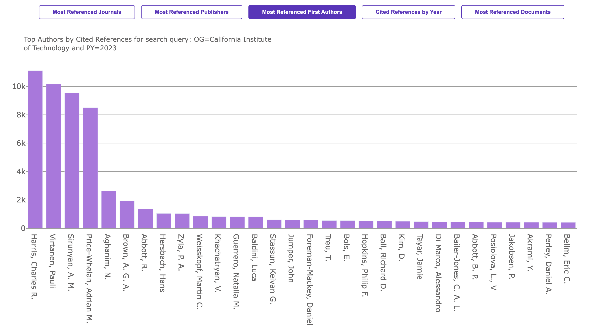
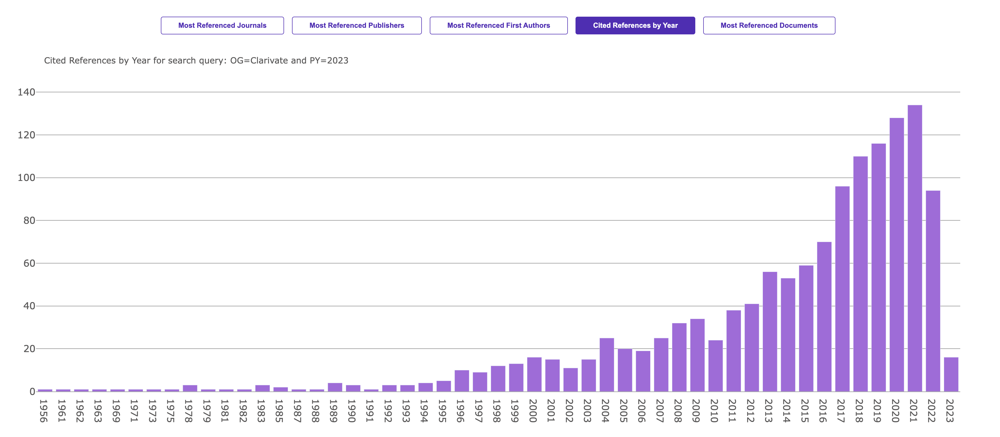
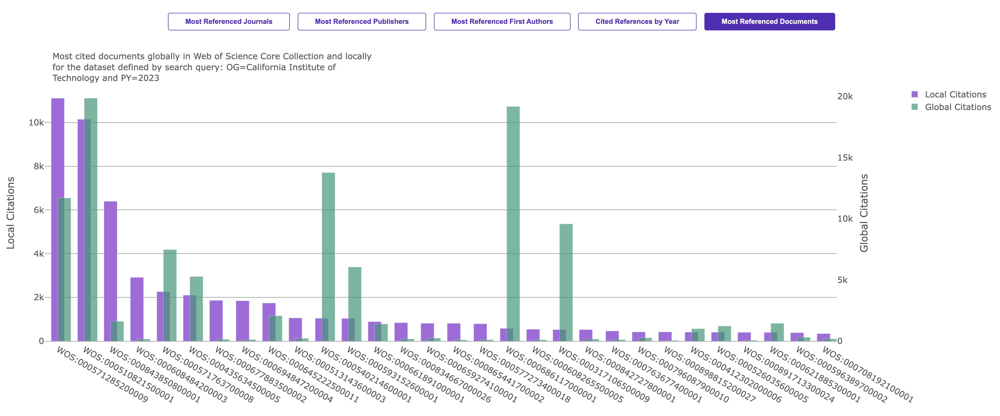

# Web of Science Cited Data Analytics via Web of Science Expanded API



## A Flask application with a simple graphical user interface to analyse and visualise the cited references data from Web of Science Core Collection. The application retrieves the data using Web of Science Expanded API.

This application allows to analyse which journals, publishers, or author names were referenced by any Web of Science Core Collection dataset that you can define by an advanced search query (but not Cited Reference search). It retrieves cited references (and, for certain fields, full record metadata) using Web of Science Expanded API, visualises it in a variety of ways with Plotly package, and saves them records metadata into an Excel spreadsheet.

#### How to use it
Download the code, open the project folder where you saved it and create there a python file `apikeys.py`. There, you need to create a constant representing your Web of Science Expanded API key and pass its value as a string like in the example below:

```
EXPANDED_APIKEY = 'mYw3b0f$c14nc33xp4nd3d4p1k3y1$4$3cr37'
```

You might also need to install the project dependencies, which are:
- Flask;
- Pandas (and openpyxl);
- Requests;
- Plotly.

And launch the app.py file. Flask will create a development server on http://127.0.0.1:5000 which you can open locally in any browser. This is what the start page looks like:


On the webpage, you can enter a Web of Science Core Collection Advanced Search query, i.e., for an affiliation search on Clarivate for publication year of 2023 (you can simply replace Clarivate with your organisation name):

```
OG=Clarivate and PY=2023
```

And press the "Run" button. Please note that as Web of Science Expanded API has a limit of 100,000 records to be retrieved per search query, it is a good idea to validate your search if you're not sure how many records it's going to return.

The data retrieval should take quite some time. Because the /references endpoint of Web of Science Expanded API accepts individual Web of Science document IDs, it takes at least one API call to retrieve cited references for a single document, so if your dataset contains more than 100 Web of Science records, the data retrieval might take some time but the process can easily be run in the background. You can track the progress in your Python window or in the Run view of your IDE if you're launching the program from there. 

When the data extraction is complete, the program will refresh the page and add the interactive visualisation plots with Plotly which you can switch between. It will also save an Excel file with all the metadata retrieved into a /downloads/ subfolder of the project folder.


You can also use the Load a Previously Saved Excel File form to visualise previously saved files.

These are some of the examples of the visualisations:








This application was created to demonstrate the capabilities of Web of Science APIs and custom XML data, and is not a commercial product of Clarivate. It will be reviewed and updated in the future but it will not have the same regular update frequency we normally offer for our commercial products. We do not recommend using this application as a ready-made solution as it is for reporting purposes or for supporting important grant funding decisions. We however encourage the bibliometric community provide feedback on improving this script and to use the script as a base for more advanced analytical projects.

For a consistent experience, intuitive user interface and world-class customer support, please refer to our products like Web of Science, InCites Benchmarking & Analytics, and Journal Citation Reports.
