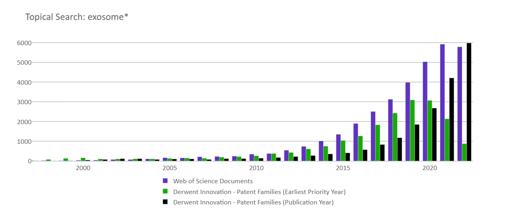
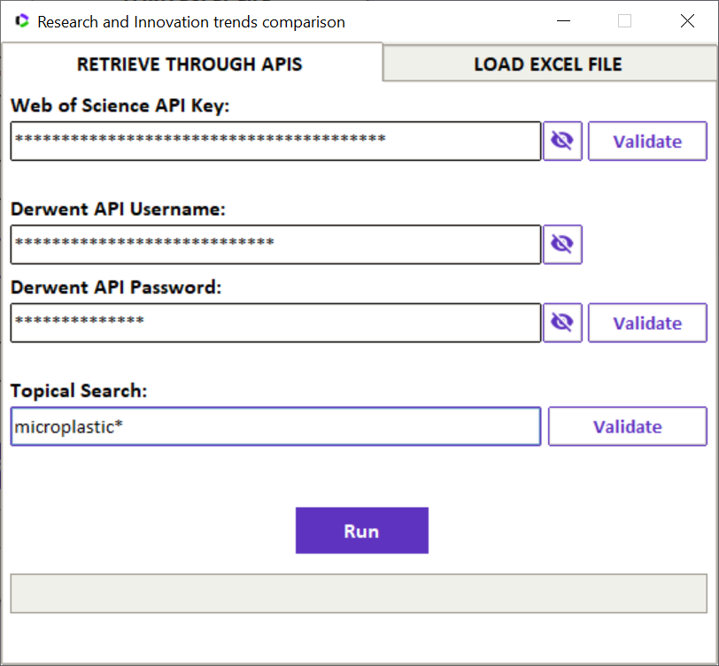

# Compare research and innovation trends

## A script that demonstrates the power of unifying the research data from Web of Science and patents data from Derwent Innovation. It queries both databases with the same topical search, analyses the annual research and innovation dynamics for it, visualises them as a bar chart using Plotly, and also saves the trend data as a .csv file for further analysis. The code uses any Web of Science API and Derwent API.

By "any Web of Science API" we mean that it accepts Web of Science Expanded, Web of Science Lite, or Web of Science Starter API keys, detects the API type by sending a test request with the API key, and retrieves the documents using that particular API - any of them works for this use case.

This is how the code works:

#### The user needs to launch the main.py file and, on the RETRIEVE THROUGH API tab, enter:
1. Their Web of Science API key;
2. Their Derwent API login and password;
3. The topical search query

And click the Run button.

The program will query Web of Science API for the scholarly document data, then query the Derwent API for the patent data. It will extract the fields of publication year from each of them, and use the Plotly library to draw a bar chart to visualise their annual dynamics, and also create an Excel file in the same project folder that will contain the following columns for each year:
- A number of Web of Science documents that contain the topical search keyword and were published that year
- A number of patent families that contain the topical search keyword and received their earliest priority that year
- A number of patent families that contain the topical search keyword and were published that year

The saved Excel files can later be loaded with the second tab of the application, "LOAD EXCEL FILE".

Here is another example of the graphs that the code produces:

And a screenshot of a typical Excel file:

We considered it important to distinguish the earliest priority years and publication years for the patent families as there is normally an 18 months gap between the patent application submission and its publication by the patent office. We have to stress that in scholarly publishing, there is also normally a significant gap between the manuscript submission date and its publication date, but there are no standard timeframes for the manuscript processing from submission to publication, and their range varies greatly from a few weeks to a few years in certain cases.

The main use case of this code is comparing the trends in research and innovation for a given topic. In certain cases, like, for instance, topics of fullerenes, cubesats, or exosomes, there would be an obvious exponential growth in research output, followed by a similar exponential growth in the number of registered inventions. The gaps between these trends can sometimes reach several years. While, in other cases, like in blockchain research or convolutional neural networks research, the exponential growth trends would more or less go hand in hand, with an obvious domination of patent documents in the earlier years of the topic development.

A few important considerations regarding this algorithm:
1. Although it is possible to send similar topical search queries to both Web of Science and Derwent Innovation, the code currently only sends simple one-word queries, like "exosomes", or multi-word ones, like "selective serotonin reuptake inibitor", using common truncation symbols like asterisk is also possible, i.e. "cubesat*". Currently the code doesn't support the boolean search operators, like AND, OR, NOT, SAME, or proximity operators, some of which work with minor differences for each of the databases. However, it is possible to improve the algorithm to also accept the more complex queries.
2. The code sends a search query to Web of Science Core Collection which is equal to "Topic" basic search, or "TS=" advanced search. The query sent to Derwent Innovation is a bit more complex, relying on a number of search fields which, added together, are similar to the "Text Fields" fielded search or "ALL=" expert search in Derwent Innovation. For more information on the Derwent search fields, please refer to [Derwent Innovation help file]( https://www.derwentinnovation.com/tip-innovation/support/help/patent_fields.htm#all_text_fields)
3. Derwent API works with Derwent Innovation, the professional platform for patent analysis. Clarivate also offers Derwent Innovations Index, a database available on subscription at Web of Science platform, which is a related but different resource. Derwent Innovations Index data can be retrieved using Web of Science Expanded API, for an interesting use case utilising this approach for analysing patent citations to individual scholarly documents please refer to this code: [Citations from Patents Report](/../main/citations_from_patents)

As always, we welcome any feedback to further improve this algorithm.
