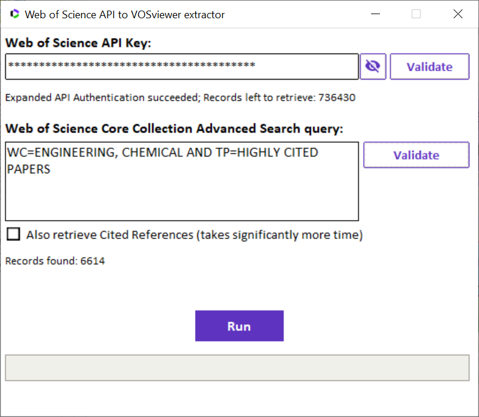

# Web of Science to VOSviewer exporter

## A program with a simple GUI to export the necessary Web of Science metadata via Web of Science API to use it in the VOSviewer

This app isn't necessary going to reduce the time it takes to export the Web of Science data, but it will definitely allow you to enter the search query that you would like to analyse on the VOSviewer, hit the "run" button, and forget about the exporting process until it's finished. All you need to do is:

#### Launch the main.py file and:

1. Enter your Web of Science API key (Expanded is preferred, but Starter API will also work for a limited number of metadata fields)
2. Enter the search query that defines the dataset you'd like to export into VOSviewer for further analysis
3. Click "Run".

The program will retrieve all the necessary documents from the Web of Science via the API, extract the metadata fields required for analysis in VOSviewer, and save them into a tab-delimited file in the same project folder. This file can then be easily uploaded into VOSviewer application.

You also have an option of extracting the cited references along with the documents. The cited reference data is required to perform the citation, bibliographic coupling, and co-citation analyses, but it takes significantly longer for all the cited references to be retrieved. If you'd only like to run a co-authorship or keyword co-occurrence analysis on VOSviewer, we recommend that you leave this option unchecked.

#### Running this script on Mac

Because of some MacOS peculiarities, this script is unlikely to run smoothly on Mac and will probably result in throwing a 'NSInternalInconsistencyException', reason: 'NSWindow should only be instantiated on the main thread!'. If you prefer working on Mac, please try a [slightly different version of this script that uses Flask instead of tkinter](./python/wos_to_vosviewer_exporter_flask/.

As always, we welcome your feedback on this code.